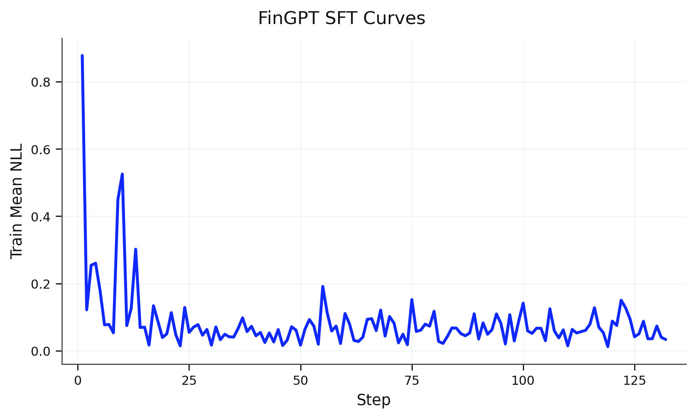
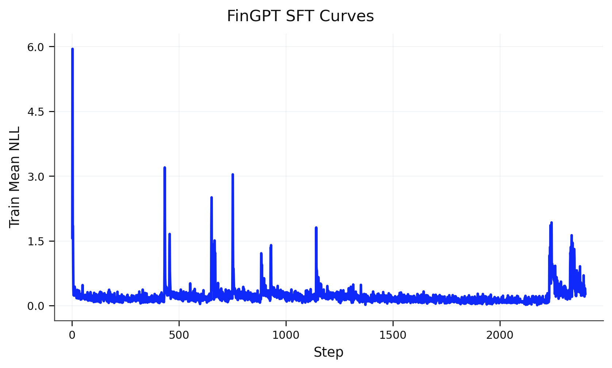

# fingpt

This directory is a self-contained MinT experiment for FinGPT-style finance instruction tuning.
It keeps two runnable lines under one runtime: the official Fineval slice as the benchmark anchor, and a maintained sentiment SFT wrapper with held-out confirmation reruns.

Current runnable scope:

- benchmark anchor: `fineval:data/fingpt-fineval/test.jsonl`
- maintained wrapper: bounded held-out sentiment eval on `fpb`, `fiqa-sa`, `tfns`, and `nwgi` (`autoresearch.sh` keeps `--eval-limit 100`)
- base model: `Qwen/Qwen3-4B-Instruct-2507`
- training routes: Fineval-slice LoRA SFT and sentiment LoRA SFT via `autoresearch.sh`
- primary metrics: `METRIC eval_accuracy=...`; sentiment also reports `eval_micro_f1`, `eval_weighted_f1`, and `eval_macro_f1`
- reportable data: `data/fingpt-fineval/test.jsonl` and the four held-out sentiment `test.jsonl` files

This experiment does not claim a full paper-faithful reproduction of the whole FinGPT family.
Fineval and sentiment remain separate local lines with different purposes: Fineval is the benchmark anchor, while the canonical wrapper currently targets sentiment.

## Quickstart

The fastest repo-local order is:

1. sync the environment and set `MINT_*`
2. run the credential-free Fineval dry-run smoke path with `--eval-data smoke:data/smoke_eval.jsonl`
3. download or refresh the local Fineval and sentiment artifacts
4. run a bounded live eval-only smoke check before the full 265-row Fineval baseline rerun
5. run either Fineval slice SFT or the sentiment wrapper
6. rerun the intended eval-only path with explicit `--eval-data` and `--base-model <sampler_path>` from a saved checkpoint export, for example Fineval `--eval-only --task-type fineval --eval-data fineval:data/fingpt-fineval/test.jsonl --base-model <sampler_path>`

Set up the environment and local credentials:

```bash
cd experiments/fingpt
uv sync
cp ../../.env.example .env  # if needed
# then fill in MINT_BASE_URL and MINT_API_KEY in .env
```

Validate the local harness without remote calls:

```bash
uv run train.py --dry-run --task-type fineval \
  --eval-data smoke:data/smoke_eval.jsonl
```

For the cheapest real live eval-only confirmation, run the dedicated live smoke test first:

```bash
uv run python -m unittest tests.test_train.LiveFinGPTFlowTest.test_eval_only_live_smoke
```

Download or refresh the currently used local data:

```bash
uv run python data/download_fingpt_fineval.py
uv run python data/download_fingpt_sentiment.py
uv run python data/download_fingpt_sentiment_benchmarks.py
uv run python data/make_sentiment_train_eval_subset.py
```

### Fineval benchmark line

Rerun the Fineval base-model eval:

```bash
uv run train.py --eval-only \
  --task-type fineval \
  --base-model Qwen/Qwen3-4B-Instruct-2507 \
  --eval-data fineval:data/fingpt-fineval/test.jsonl \
  --eval-limit 0 \
  --eval-max-tokens 256 \
  --max-concurrent-requests 8 \
  --mint-timeout 600 \
  --seed 42 \
  --log-path artifacts/runs/fineval-base-$(date +%Y%m%d-%H%M%S)
```

Run the Fineval slice SFT line plus final eval:

```bash
uv run train.py \
  --task-type fineval \
  --base-model Qwen/Qwen3-4B-Instruct-2507 \
  --train-data data/fingpt-fineval/train.jsonl \
  --eval-data fineval:data/fingpt-fineval/test.jsonl \
  --log-path artifacts/runs/fineval-sft-1epoch-$(date +%Y%m%d-%H%M%S) \
  --num-epochs 1 \
  --batch-size 8 \
  --learning-rate 1e-4 \
  --rank 16
```

### Sentiment wrapper line

Run the canonical sentiment train-and-eval wrapper:

```bash
bash autoresearch.sh
```

The wrapper is a search path, not a reportable full held-out confirmation path:
it keeps `--eval-limit 100` and uses `train-eval-160` for periodic checks.

For a clean held-out confirmation rerun against a saved checkpoint, use the recorded `sampler_path` with `--eval-limit 0`:

```bash
uv run train.py --eval-only \
  --task-type sentiment \
  --base-model '<sampler_path>' \
  --eval-limit 0 \
  --eval-max-tokens 256 \
  --max-concurrent-requests 128 \
  --mint-timeout 600 \
  --seed 42 \
  --eval-data "fpb:data/benchmarks/sentiment/fpb/test.jsonl,fiqa-sa:data/benchmarks/sentiment/fiqa-sa/test.jsonl,tfns:data/benchmarks/sentiment/tfns/test.jsonl,nwgi:data/benchmarks/sentiment/nwgi/test.jsonl" \
  --log-path artifacts/runs/sentiment-confirm-$(date +%Y%m%d-%H%M%S)
```

If you want per-dataset confirmation runs instead of one combined rerun, replace the `--eval-data` list with one `name:path` pair.

### Run modes and restore

- Fineval remains the benchmark anchor. Use `--task-type fineval` for the baseline benchmark path and Fineval-slice SFT.
- `--train-data` defaults to `data/fingpt-fineval/train.jsonl` when `--task-type fineval`; non-Fineval training should pass an explicit task-specific train manifest.
- Pass the full held-out `FPB`, `FiQA-SA`, `TFNS`, and `NWGI` bundle explicitly in `--eval-data` for sentiment confirmation runs.
- `bash autoresearch.sh` is the canonical automation wrapper for the current sentiment line, not the Fineval anchor.
- same-run resume is directory-driven: rerun the same training command with the same `--log-path` and `train.py` restores from the latest resumable `state_path` in `train/checkpoints.jsonl`.
- `--load-checkpoint-path` starts a fresh weight-only run and does not continue the old append-only logs.

For each reportable run, keep the evidence bundle together: `run.json`, `console.log`, `eval/metrics.json`, `eval/predictions.jsonl`, and `train/checkpoints.jsonl` when checkpoints are produced.

## Fast contract tests

This experiment no longer keeps a separate credential-free contract unittest tier. Use the live smoke suite below as the maintained validation path.

## Live smoke tests

Default train-flow validation uses the real MinT backend:

```bash
uv run python -m unittest tests.test_train
```

This live suite stays on tiny local slices and covers the current user-facing entrypoints:

- Fineval `--eval-only`
- Fineval smoke train
- interrupted same-run automatic resume by rerunning the same `--log-path`
- sentiment `--eval-only`
- Fineval `--eval-only --task-type fineval --eval-data fineval:data/fingpt-fineval/test.jsonl --base-model <sampler_path>` from a saved checkpoint


## Data

| Line | Path | Rows | Purpose |
| --- | --- | ---: | --- |
| Fineval train | `data/fingpt-fineval/train.jsonl` | 1056 | Fineval-slice SFT |
| Fineval eval | `data/fingpt-fineval/test.jsonl` | 265 | Fineval benchmark anchor |
| Sentiment train | `data/fingpt-sentiment-train/train.jsonl` | 76775 | wrapper train corpus |
| Sentiment eval `FPB` | `data/benchmarks/sentiment/fpb/test.jsonl` | 1212 | held-out confirmation |
| Sentiment eval `FiQA-SA` | `data/benchmarks/sentiment/fiqa-sa/test.jsonl` | 275 | held-out confirmation |
| Sentiment eval `TFNS` | `data/benchmarks/sentiment/tfns/test.jsonl` | 2388 | held-out confirmation |
| Sentiment eval `NWGI` | `data/benchmarks/sentiment/nwgi/test.jsonl` | 4047 | held-out confirmation |
| Sentiment train-time eval | `data/benchmarks/sentiment/train-eval-160/all/test.jsonl` | 160 | periodic wrapper eval only |
| Smoke train | `data/smoke_train.jsonl` | 2 | validation only |
| Smoke eval | `data/smoke_eval.jsonl` | 2 | validation only |

Provenance and split rules live in `data/README.md` and `data/sources.yaml`.
Do not report smoke rows or the `train-eval-160` subset as benchmark results.

### Benchmark contract

- Fineval uses `instruction` / `input` / `output` rows and reports `eval_accuracy` as the benchmark metric.
- Sentiment uses `name:path` eval specs, reports aggregate `eval_accuracy`, `eval_micro_f1`, `eval_macro_f1`, and `eval_weighted_f1`, and also writes per-dataset metrics such as `fpb_accuracy` and `nwgi_weighted_f1`.
- `run.json` records the resolved eval datasets, overlap audit, and artifact pointers for both lines.

## Current results

Status: `checked`

### Fineval

Run context:

- data: `data/fingpt-fineval/test.jsonl` (`265` rows)
- base model: `Qwen/Qwen3-4B-Instruct-2507`
- train config: `num_epochs=1`, `batch_size=8`, `learning_rate=1e-4`, `rank=16`
- eval config: `eval_limit=0`, `eval_max_tokens=256`, `max_concurrent_requests=8`, `mint_timeout=600`, `seed=42`

| Run | Model or checkpoint | `eval_accuracy` | Wall time | Artifacts |
| --- | --- | ---: | --- | --- |
| base eval | `Qwen/Qwen3-4B-Instruct-2507` | `0.4226` (`112/265`) | `221.2s` | `artifacts/fineval0422/base-qwen3-4b-20260422-155337` |
| final Fineval SFT eval | final `sampler_path` from `run.json` | `0.7811` (`207/265`) | `3498.5s` train+eval | `artifacts/fineval0422/sft-1epoch-qwen3-4b-20260422-155942` |

Delta vs base: `+0.3585` accuracy and `+95` correct answers.

Timing note: the checked Fineval SFT run spent `2995.6s` in the train loop over `132` steps; the remainder is save and final eval overhead.



### Sentiment

Checked sentiment runs split into two layers:

- the canonical wrapper run at `artifacts/sentiment0422/sft-1epoch-sentiment-qwen3-4b-20260419-233712` is the bounded search line and uses `--eval-limit 100` with `train-eval-160`
- the reportable held-out numbers below come from separate `--eval-only --eval-limit 0` confirmation reruns on the full benchmark splits

Run context:

- train config: `num_epochs=1`, `batch_size=32`, `learning_rate=1e-4`, `rank=16`
- wrapper search config: `eval_limit=100`, `max_concurrent_requests=128`, `train-eval-160` periodic eval
- confirmation eval config: base-model reruns used `max_concurrent_requests=16`; saved-checkpoint reruns used `max_concurrent_requests=128`
- checkpoint compared here: the saved `step 2000` sampler recorded in `artifacts/sentiment0422/sft-1epoch-sentiment-qwen3-4b-20260419-233712/train/checkpoints.jsonl`

| Dataset | Repo base acc | Repo base weighted F1 | Step-2000 acc | Step-2000 weighted F1 | Acc delta | Weighted F1 delta |
| --- | ---: | ---: | ---: | ---: | ---: | ---: |
| `FPB` | `0.6906` | `0.6894` | `0.8804` | `0.8806` | `+0.1898` | `+0.1912` |
| `FiQA-SA` | `0.8255` | `0.8318` | `0.8473` | `0.8704` | `+0.0218` | `+0.0386` |
| `TFNS` | `0.5959` | `0.5913` | `0.9095` | `0.9099` | `+0.3137` | `+0.3186` |
| `NWGI` | `0.4954` | `0.4497` | `0.5925` | `0.5626` | `+0.0971` | `+0.1129` |

Timing notes from checked held-out reruns:

- base-model reruns: `FPB 643.6s`, `FiQA-SA 123.6s`, `TFNS 1072.7s`, `NWGI 1780.2s`
- step-2000 reruns: `FPB 71.4s`, `FiQA-SA 22.1s`, `TFNS 110.5s`, `NWGI 600.8s`
- if the four base-model reruns are launched in parallel, the batch wall-clock is `1780.2s` (dominated by `NWGI`)
- the checked step-2000 reruns were sequential, so their batch wall-clock is `804.8s`
- the canonical sentiment train-and-eval wrapper run took `121922.0s` total, with `121856.0s` spent in the train loop over `2399` steps

The saved step-2000 checkpoint is better than the repo-local base model on all four held-out sentiment tasks.



## References

- Scope requirement: `requirements/fingpt-on-mint/README.md` (use this README plus `train.py` for the current wrapper and runtime contract)
- Local data guide: `data/README.md`
- Local provenance: `data/sources.yaml`
- FinGPT paper: `https://openreview.net/forum?id=FuOMomaQa8`
- Official `fingpt-fineval` dataset: `https://huggingface.co/datasets/FinGPT/fingpt-fineval`
- FinGPT datasets page: `https://huggingface.co/FinGPT/datasets`
- Official FinGPT repository: `https://github.com/AI4Finance-Foundation/FinGPT`
